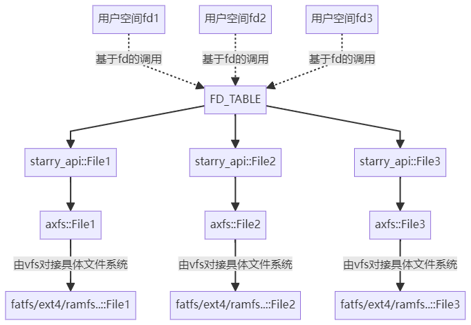
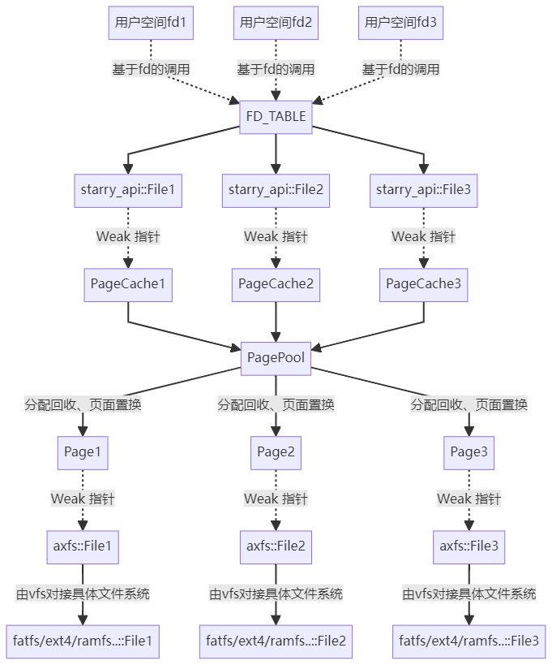
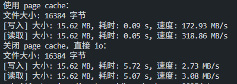

# 2025 春夏季开源操作系统训练营报告（未写完）

程琦，华南理工大学电力学院，电气工程及其自动化专业本科。

## 一、工作概述

### 1.1 核心工作

1. 编写一整完整的 **页缓存** 系统，接入文件和 mmap相关系统调用，pr 正在 review。
2. 实现一套 **共享内存** 机制，帮助部分同学通过全国大学生 OS 比赛地=的 iozone 测例。

以上两项工作都是全新的 feature，合计约 2600+ 行代码

### 1.2 辅助工作

1. 修改 arceos，以适配页缓存。
2. 完善 page_table_multiarch 组件。

以上两项工作均为补丁性质，没有实现新的模块。

## 二、页缓存系统

### 2.1 页缓存架构设计：文件

核心组件介绍。首先介绍 page cache 无关的组件：
- `starry_api::File`
- `FD_TABLE`
- `ramfs/ext4/ramfs::File`

page cache 相关组件：
- `Page`
- `PagePool`
- `PageCache`
- `PageCacheManager`
- `VMAManager`

不使用 page cache 的文件相关操作，例如使用 direct 标志 open 文件，或者不经过 page_cache 的系统调用

经过 page cache 的系统调用，主要基于 fd，例如 `sys_read`，`sys_write`，`sys_ftruncate`，`sys_stat` 等：

### 2.2 页缓存架构设计：mmap

### 2.3 延迟加载：lazy-alloc 机制

### 2.4 页表反向映射

页表反向映射的概念：
- 多个虚拟页面可能同时映射到同一个物理页面，主要出现在多个进程共享 mmap 同一个文件；
- 我们需要根据物理页面反向找到 **所有** 映射到它的虚拟页面 `(pid, virt_page_num)`。

应用场景：
- 脏页查询，需要访问所有的相关页表项，检查 `Dirty` 位；
-  页面置换：需要修改所有的相关页表，取消页面映射。

Linux 实现方法：
- Linux 的每个物理页面指向 `struct address_space`，这里维护了整个文件所涉及的所有虚拟地址段，从中查找哪些虚拟地址段包含了当前页面。
- 通过区间树这种数据结构实现 $O(\log k)$ 的查找。
- 考虑 Starry-next 底层 Unikernel 基座的解耦性，没有采用 Linux 的实现方法。

Starry-next 实现方法：
-  每个页面 `struct Page` 都维护一个**映射集合** `virt_pages: BTreeSet<(Pid, VirtAddr)>`。用以记录所有映射到它的虚拟页面 `(pid, addr)`；
- 在 mmap 后的 lazy-alloc 时，进程的虚拟页面会映射到页缓存的物理页面，此时将映射关系加入页面映射集合，具体见 `page_cache.rs` 的 `map_virt_page` 函数；
- 在 munmap 时，需要取消某一个映射关系，从该页面的映射集合中删除相应的 `(pid, addr)`，具体见 `page_cache.rs` 的 `unmap_virt_page` 函数；
- 在页面置换时，需要取消该页面的所有映射关系，此时清空该页面的映射集合，具体见 `page_cache.rs` 的 `drop` 函数。

性能分析：
- 假设页缓存有 $n$ 个页面，涉及 $k$ 个 mmap 地址区间段：
- 时间复杂度：最坏情况 Linux 和 Starry-next 均为 $O(\log k)$，但是平均情况 Starry-next 更优，因为映射到单个页面的地址区间数量 一定不大于 涉及该文件的所有地址区间数量。
- 空间复杂度：Starry-next 为 $O(nk)$，劣于 Linux 的 $O(n + k)$。在大量进程同时 mmap 同一个文件时，可能产生较大内存开销。

### 2.5 脏页管理与页面置换

OS 内核的脏页管理与页面置换算法与数据库系统的存储引擎有所不同，主要体现在脏页的来源上。

页缓存脏页的来源：
- 文件相关系统调 ( write, pwrite 等)：可以被 OS 内核管理；
- mmap 将文件映射到地址空间后：文件读写不经过 OS 内核，由硬件直接设置 TLB 脏位，异步刷新到进程页表。所以没办法在页缓存中高效地维护一个脏页集合，以用于页面置换算法。
- 若某一个进程通过 mmap 的虚拟地址修改了文件内容，只会在该进程的的页表留下脏位标记。所以检查页面是否为脏时，必须访问与该物理页面关联的所有页表项。

Starry-next 脏页的维护：
- 在 `struct Page` 中设置一个成员 `dirty: bool`，用来维护由文件写入的系统调用造成的脏页；
- 在检查脏页时，如果 `self.dirty == true` 那必然为脏页。反之 `self.dirty == false`，仍需要遍历所有映射到该页面的虚拟页面，检查对应的页表项 `Dirty` flag 只要有一个为 `true` 那就是脏页。
- 设置干净页面的操作：设置 `self.dirty = false`，并遍历所有页表清空脏位标记。

Linux 页面置换算法：
- 有一个内核线程定期将页面刷新回文件，并清空脏页标记；
- 有一个内核线程定期清空访问位 `Access` flag。
- 根据脏位和访问位，实行 LRU 算法或时钟置换算法等。

Starry-next 页面置换算法（目前的实现较为粗糙）：
- `struct PagePool` 中维护了两个链表：
    - `clean_list: Mutex<LinkedList<PageKey>>`，记录没有被修改过的页面；
    - `dirty_list: Mutex<LinkedList<PageKey>>`，记录修改过的页面。
- 当需要 Drop 一个页面时，首先尝试 `clean_list` 中取出一个页面，如果是脏页就加入 `dirty_list` 的尾部，继续尝试从 `clean_list` 中取出页面，直到取出干净页面或者 `clean_list` 为空；
- 若 `clean_list` 空了，就只能从 `dirty_list` 中取。
- 缺陷是仅对脏页敏感，而没有考虑最近是否访问了这个页面。从测例来看，页面置换算法的选择并不是很好。

### 2.6 并发安全

page_cache 接管了所有上层的文件操作，包括文件相关的 `read, write` 以及 mmap 后的内存读写。所以只有在多个进程并发 `open` 文件的时候才会涉及 `axfs` 层的并发。

page_cache 的锁细粒度较小，精细到每个页面。锁精细化的优点是提升并发性能，缺点是容易造成死锁和同步 bug。

### 2.7 测试与性能分析
- 文件 io 测试 `page_cache.c`：用于测试页缓存的性能提升。在 ext4 系统中，大规模局部性读取文件，性能将会从文件 io 级别提升至内存读写级别。

- 大规模并发 io 测试 `concurrent_io.c`：多个进程并发使用 `pwrite` 和 `pread` 系统调用写入和读取同一文件，验证读写一致性；
- 大规模并发 mmap 测试 `concurrent_mmap.c`：多个进程同时 mmap 同一个文件到各自的地址空间，并发读写，验证读写一致性；

### 2.8 局限性与展望

当前的页缓存系统受到底层文件系统的制约：
- 底层的 axfs 在文件并发打开时，会偶发并发死锁；
- fatfs 由于链式存储结构，单次 `seek` 操作为 $O(n)$，即无法做到 $O(1)$ 的随机寻址，这是页缓存系统无法承受的，因为面对整个文件的读写操作都会从 $O(n)$ 退化到 $O(n^2)$。
- lwext4 存在并发 bug。

因此，所有的并发测例都是在 ramfs 下通过的。

当前的页缓存系统留有充分的扩展性，主要包括以下方向：
- 借助 page cache 完成共享内存系统调用
- 使 page cache 配合大页
- 异步非阻塞的加载和写回
- 改进页面置换算法

他这些工作难度不大，而且非常适合新学员理解 OS 原理、上手 rust OS 开发。可以由我慢慢实现，或者由我带领和指导下一届的训练营学员实现。

## 三、共享内存机制

## 四、训练营收获