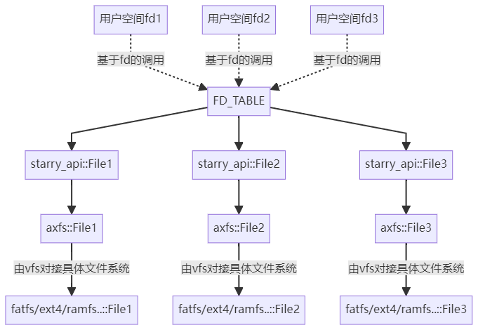
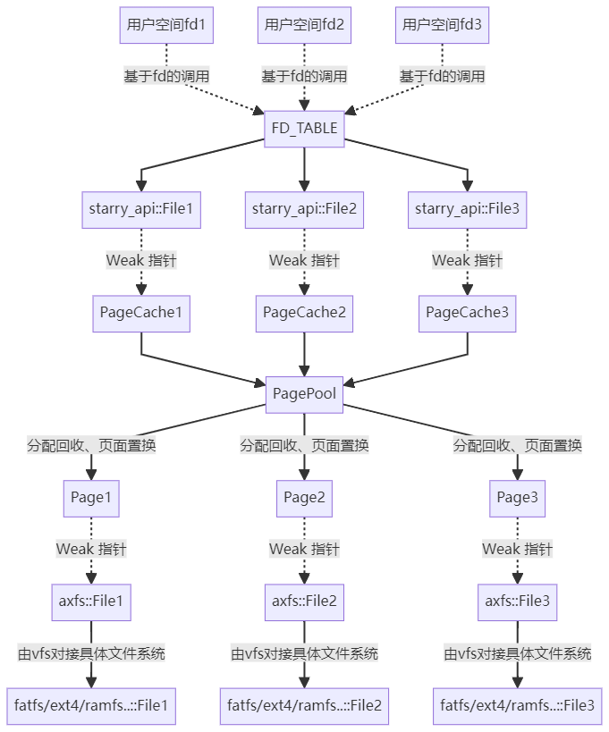
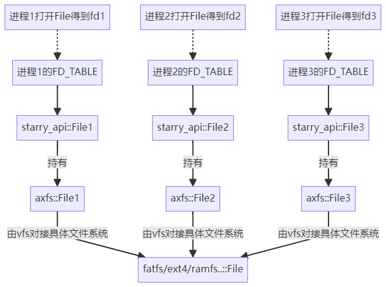
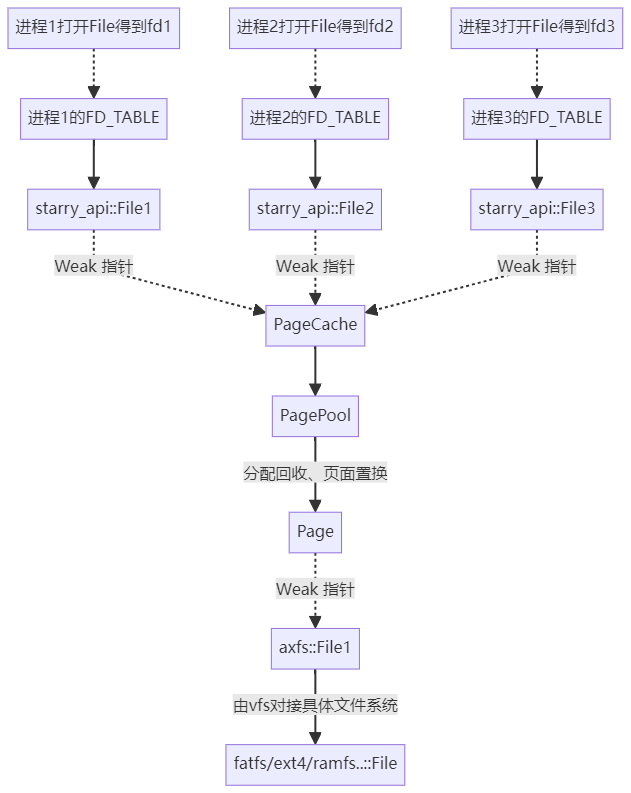
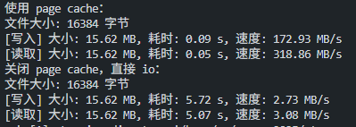

# 2025 春夏季开源操作系统训练营报告

程琦，华南理工大学电力学院，电气工程及其自动化专业本科。

---


## 一、工作概述

### 1.1 核心工作

1. 编写一整完整的 **页缓存** 系统，接入文件和 mmap相关系统调用，pr 正在 review。[pr 链接](https://github.com/oscomp/starry-next/pull/53
)
2. 实现一套 **共享内存** 机制，帮助部分同学通过全国大学生 OS 比赛的 iozone 测例。[仓库链接](https://github.com/OrangeQi-CQ/starry-next/tree/shm_SystemV)

以上两项工作都是全新的 feature，合计约 2700+ 行代码


---

### 1.2 辅助工作

1. 修改 arceos，以适配页缓存。[pr 链接](https://github.com/oscomp/arceos/pull/48
)
2. 完善 page_table_multiarch 组件。[pr 链接](https://github.com/Mivik/page_table_multiarch/pull/1
)

以上两项工作均为补丁性质，没有实现新的模块。

---

## 二、页缓存系统

### 2.1 页缓存架构设计


根据 `open` 系统调用是否含有 `DIRECT` 参数，打开的文件分为两类：一类使用页缓存，另一类绕过页缓存直接 IO。

```rust
pub enum File {
    Direct {
        path: String,
        inner: Arc<Mutex<axfs::fops::File>>,
    },
    Cached {
        path: String,
        size: AtomicUsize,
        offset: AtomicUsize,
        cache: Weak<PageCache>,
    },
}
```
---

下图表示不使用 PageCache 的文件相关操作，例如使用 direct 标志 open 文件或者不经过 page_cache 的系统调用。



---

引入 PageCache 后，相关组件介绍如下：
- `PageCacheManager`：用来管理所有的 PageCache，核心作用是让重复打开的文件能够对接到同一个 PageCache；
- `PageCache`：接管对文件的读写相关操作；
- `PagePool`：**所有的 PageCache 共用一个 PagePool**，用于限制页缓存系统占用的总内存，并实现页面置换；
- `Page`：管理页面的加载写回；


---

<!-- | 架构图 |  |
| ---- | ---- |
|  | 下图表示 PageCache 对文件相关系统调用的接管，例如 `sys_read`，`sys_write`，`sys_ftruncate`，`sys_stat` 等 | -->

<!--  -->

 
左图表示 PageCache 对文件相关系统调用的接管。

---

#### 2.1.2 对单个文件的并发 IO 

当不同进程同时打开一个文件，会创造多个 `starry_api::File`，并且可能会得到不同的 `fd`。此时对文件读写有以下要求：
- 每个进程看到的文件偏移量是独立的，即进程1正在位置 `i` 写入，进程 2 正在位置 `j` 写入，他们的写入位置不能互相干扰；
- 每个进程对文件的读写要保证一致性，即进程 1 写入的内容能被进程 2 看到；

当不使用 PageCache 直接 io 时，在 `axfs::File` 层维护每个进程看到的文件偏移量，并由具体的文件系统确保读写一致性。

---

架构图如下：



---

使用 PageCache 时，在 `starry_api::File` 层维护每个进程看到的文件偏移量，由 PageCache 实现读写一致性。

此时所有的并发读写操作全部由 PageCache 接管，从底层 `axfs::File` 的视角只有 `open` 操作涉及到并发。具体架构如下：

---


<!--  -->


---

### 2.2 页缓存对 mmap 的接管

根据匿名/文件、私有/共享，主要有 4 种 mmap：
1. 匿名私有：相当于 malloc。
2. 匿名共享：相当于 Private 的共享内存，只能在父子进程之间共享。 
3. 文件私有：仅将文件内容加载进内存，但是修改不会同步到文件。
4. 文件共享：对文件的修改会被同步，并且允许多个进程并发读写文件。底层会将不同进程的虚拟页面映射到同一个页缓存物理页面。

页缓存实现了共享文件映射，即允许多个进程同时将一个文件映射到自己的地址空间，满足读写一致性。

**原理是将 mmap 分配的虚拟页映射到 PageCache 的缓存页面**。

---

### 2.3 延迟加载：lazy-alloc 机制

ArceOS 中有 lazy-alloc 机制，即分配的地址段不会立即建立页表，而是在访问页面并触发 page fault 时再分配页面并在页表中建立映射关系。

Starry-next 在执行 mmap 时，内核不会立即将整个文件加载到内存，而是在需要的时候再进行加载。具体如下：

- mmap 时仅在 AddressSpace 中分配了地址段，但没有建立页表。
- 访问该内存时，因页表查找失败会触发 page fault，交由 starr-next 的 `handle_page_fault` 函数处理。
- 在 `handle_page_fault` 函数中会执行 `lazy_map_file` 函数，尝试从文件中加载页面。

---

- 每个进程都有一个 `struct ProcessVMAManager`，管理该进程的所有 mmap 地址段。`lazy_map_file` 函数会利用 `ProcessVMAManager` 来查询这个页面是否为 mmap 的文件映射，并获取相应的信息（`fd`，`offset` 等）。
- 如果查询成功，就会通过 `PageCacheManager` 找到对应文件的 PageCache，并进行页表映射。

在 `munmap` 时，会直接取消整个地址段的页表映射。

从底层 ArceOS 基座的视角，上层 Starry-next 的 mmap 分配的地址段，**所有页面始终是非 Populate 且一直未使用的状态**，因为页表的 `map` 与 `unmap` 操作分别由 Starry-next 层处理，都没有经过 ArceOS 层。

---

### 2.4 页表反向映射

页表反向映射的概念：
- 多个虚拟页面可能同时映射到同一个物理页面，主要出现在多个进程共享 mmap 同一个文件；
- 我们需要根据物理页面反向找到 **所有** 映射到它的虚拟页面 `(pid, virt_page_num)`。

应用场景：
- 脏页查询：需要访问所有的相关页表项，检查 `Dirty` 位；
- 页面置换：需要修改所有的相关页表，取消页面映射。

---

Linux 实现方法：
- Linux 的每个物理页面指向 `struct address_space`，这里维护了整个文件所涉及的所有虚拟地址段，从中查找哪些虚拟地址段包含了当前页面。
- 通过区间树这种数据结构实现 $O(\log k)$ 的查找。
- 考虑 Starry-next 底层 Unikernel 基座的解耦性，没有采用 Linux 的实现方法。

---

Starry-next 实现方法：
-  每个页面 `struct Page` 都维护一个**映射集合** `virt_pages: BTreeSet<(Pid, VirtAddr)>`。用以记录所有映射到它的虚拟页面 `(pid, addr)`；
- 在 mmap 后的 lazy-alloc 时，进程的虚拟页面会映射到页缓存的物理页面，此时将映射关系加入页面映射集合，具体见 `page_cache.rs` 的 `map_virt_page` 函数；
- 在 munmap 时，需要取消某一个映射关系，从该页面的映射集合中删除相应的 `(pid, addr)`，具体见 `page_cache.rs` 的 `unmap_virt_page` 函数；
- 在页面置换时，需要取消该页面的所有映射关系，此时清空该页面的映射集合，具体见 `page_cache.rs` 的 `drop` 函数。

---

性能分析：
- 假设页缓存有 $n$ 个页面，涉及 $k$ 个 mmap 地址区间段：
- 时间复杂度：最坏情况 Linux 和 Starry-next 均为 $O(\log k)$，但是平均情况 Starry-next 更优，因为映射到单个页面的地址区间数量 一定不大于 涉及该文件的所有地址区间数量。
- 空间复杂度：Starry-next 为 $O(nk)$，劣于 Linux 的 $O(n + k)$。在大量进程同时 mmap 同一个文件时，可能产生较大内存开销。

---

### 2.5 脏页管理与页面置换

OS 内核的脏页管理与页面置换算法与数据库系统的存储引擎有所不同，主要体现在脏页的来源上。

页缓存脏页的来源：
- 文件相关系统调 ( write, pwrite 等)：可以被 OS 内核管理；
- mmap 将文件映射到地址空间后：**文件读写通过内存读写实现，不经过 OS 内核**，由硬件直接设置 TLB 访问位和脏位，异步刷新到进程页表。所以没办法在页缓存中高效地维护一个脏页集合，以用于页面置换算法。
- 若某一个进程通过 mmap 的虚拟地址修改了文件内容，只会在该进程的的页表留下脏位标记。所以检查页面是否为脏时，必须访问与该物理页面关联的所有页表项。

---

Starry-next 脏页的维护：
- 在 `struct Page` 中设置一个成员 `dirty: bool`，用来维护由文件写入的系统调用造成的脏页；
- 在检查脏页时，如果 `self.dirty == true` 那必然为脏页。反之 `self.dirty == false`，仍需要遍历所有映射到该页面的虚拟页面，检查对应的页表项 `Dirty` flag 只要有一个为 `true` 那就是脏页。
- 设置干净页面的操作：设置 `self.dirty = false`，并遍历所有页表清空脏位标记。

---

Linux 页面置换算法：
- 有一个内核线程定期将页面刷新回文件，并清空脏页标记；
- 有一个内核线程定期清空访问位 `Access` flag。
- 根据脏位和访问位，实行 LRU 算法或时钟置换算法等。

---

Starry-next 页面置换算法（目前的实现较为粗糙，主要思想是置换掉干净页，不需要写回）：
- `struct PagePool` 中维护了两个链表：
    - `clean_list: Mutex<LinkedList<PageKey>>`，记录没有被修改过的页面；
    - `dirty_list: Mutex<LinkedList<PageKey>>`，记录修改过的页面。
- 当需要 Drop 一个页面时，首先尝试 `clean_list` 中取出一个页面，如果是脏页就加入 `dirty_list` 的尾部，继续尝试从 `clean_list` 中取出页面，直到取出干净页面或者 `clean_list` 为空；
- 若 `clean_list` 空了，就只能从 `dirty_list` 中取。
- 缺陷是仅对脏页敏感，而没有考虑最近是否访问了这个页面。从测例来看，页面置换算法的选择并不是很好。

---

### 2.6 并发安全与内存安全

page_cache 接管了所有上层的文件操作，包括文件相关的 `read, write` 以及 mmap 后的内存读写。所以只有在多个进程并发 `open` 文件的时候才会涉及 `axfs` 层的并发。

page_cache 的锁细粒度较小，精细到每个页面。锁精细化的优点是提升并发性能，缺点是容易造成死锁和其他各种同步 bug。这里主要利用了Rust 的 `LockGuard` 和 RAII 策略。具体可见 `PagePool::acquire_page`，`PageCache::_with_valid_page` 等函数。

内存安全上，主要依赖 RAII 策略，保证页面在释放时会自动写回文件。

---

### 2.7 测试与性能分析

测例：
- 文件 io 测试 `page_cache.c`：用于测试页缓存的性能提升。



- 大规模并发 io 测试 `concurrent_io.c`：多个进程并发使用 `pwrite` 和 `pread` 系统调用写入和读取同一文件，验证读写一致性；
- 大规模并发 mmap 测试 `concurrent_mmap.c`：多个进程同时 mmap 同一个文件到各自的地址空间，并发读写，验证读写一致性；

---

时间性能分析：
- 大规模**局部性**读取文件，时间性能将会从文件 io 级别提升至内存读写级别。
- 单次写文件，页缓存并不会因内存拷贝造成额外的时间开销。因为即便是绕过页缓存的直接 IO，也需要将写入内容从用户空间拷贝到内核空间。
- 单次读文件，会造成一次额外的内存拷贝开销。

---

空间性能分析：
- `struct Page` 占用 `64 Bytes`，它的存储形式为 `struct PagePool` 中的键值对 `(PageKey, Arc<RwLock<Page>>)`，合计占用 `80 Bytes`。此外，`PagePool::dirty_page_list`，`PagePool::dirty_page_list`，`PageCache::Pages` 中也有相关的指针，总计一个缓存页的维护信息占用 `104 Bytes`。
- $104/4096=2.5\%$，是能够接受的额外内存开销。
- 前文提到，在大量进程同时 mmap 同一个文件时，可能因页表反向映射机制产生较大内存开销。

---

### 2.8 局限性与展望

当前的页缓存系统受到底层文件系统的制约：
- 底层的 axfs 在文件并发打开时，会偶发并发死锁；
- fatfs 由于链式存储结构，单次 `seek` 操作为 $O(n)$，即无法做到 $O(1)$ 的随机寻址，这是页缓存系统无法承受的，因为面对整个文件的读写操作都会从 $O(n)$ 退化到 $O(n^2)$。
- lwext4 存在并发 bug。

因此，所有的并发测例都是在 ramfs 下通过的。

---

当前的页缓存系统留有充分的扩展性，主要包括以下方向：
- 借助 page cache 完成共享内存系统调用
- 使 page cache 配合大页
- 异步非阻塞的加载和写回
- 改进页面置换算法

这些工作难度不大，而且非常适合新学员理解 OS 原理、上手 rust OS 开发。可以由我慢慢实现，或者由我带领和指导下一届的训练营学员实现。

---

## 三、共享内存机制

在 starry-next 层实现了共享内存，价值是帮助了一些同学通过全国大学生 OS 比赛的 iozone 测例，但该实现扩展性较低，因此没有合并到主线。

目前正在编写基于 PageCache 和 mmap 的共享内存。

---

## 四、训练营收获

入门了 Rust for OS 开发，一方面提升了对 OS 的理解，另一方面入门了 Rust 编程。

未来会持续给 Starry-next 做贡献，并继续参与其他开源 Rust OS 社区（DragonOS, OcclumOS 等）。

目前已经申请中科院开源之夏的项目《基于 Occlum 实现 System V 信号量系统调用》，项目导师是贾越凯博士。


> Occlum 由蚂蚁集团研发，使用 Rust 编写。是一个适用于 Intel SGX 的内存安全、多进程库操作系统（LibOS），可以让旧应用无需修改源码就运行在 SGX 之上，从而以透明的方式保护用户应用的机密性和完整性。
> 

---

## 五、致谢

感谢陈渝老师和郑友捷老师的指导和帮助。

感谢苏博文同学和王艳东同学，我们三人共同完善了 Starry-next 的地址空间相关模块，在讨论交流中收获良多。